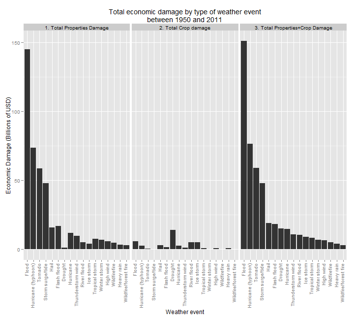

# Weather events: effects on population health and economic consequences 

Author: jfs

Date: 23 Aug 2014

## Synopsis
Weather can cause many issues. The most relevant ones are the effects on the
population that suffers the wrath of the elements. People can drown as a
consequence of a flood, or can be hit to death by some object flying as a
consequence of strong winds. Besides, the economic damage can also be high.
Roads and towns destroyed by floods, houses destroyed by tornadoes, etc.

## Data Processing
Note: I assume the file containing the raw data is in the working directory.

We can read the data directly from the bz2 file. But the data file is rather
large (47MB compressed, 535MB uncompressed!!!), so it may take a while to
load...

A purely technical note here: sometimes while loading the data, my machine gets
stuck, so first I decompress the file, and then I load the data. Anyway, the
loading time is rather long. To avoid decompressing and/or loading the data each
time I run knitr to create the HTML document, I check whether they already exist
on disk and/or in memory.

### Downloading the data
The raw data are provided by the instructors of the *Reproducible Research*
course on Coursera, and can be downloaded from the course web site:

- [Storm Data](https://d396qusza40orc.cloudfront.net/repdata/data/StormData.csv.bz2).

Some documentation is also available:

- National Weather Service [Storm Data Documentation](https://d396qusza40orc.cloudfront.net/repdata/peer2_doc/pd01016005curr.pdf)
- National Climatic Data center Storm Events [FAQ](https://d396qusza40orc.cloudfront.net/repdata/peer2_doc/NCDC%20Storm%20Events-FAQ%20Page.pdf)

### Loading the data
In order to have only the data needed for the analysis, I only read the columns
I need. Namely: `BGN_DATE`, `END_DATE`, `EVTYPE`, `FATALITIES`, `INJURIES`,
`PROPDMG`, `PROPDMGEXP`, `CROPDMG`, and `CROPDMGEXP`.

```r
DATAFILE <- "./StormData.csv"
COMPDATAFILE <- paste0("./StormData.csv", ".bz2")

wanted <- c("BGN_DATE", "END_DATE", "EVTYPE", "FATALITIES", "INJURIES",
            "PROPDMG", "PROPDMGEXP", "CROPDMG", "CROPDMGEXP")
header <- names(read.csv(COMPDATAFILE, nrows = 1))
columns <- ifelse(header %in% wanted, "character", "NULL")
# We know some of these columns are numeric
asnum <- match(c("FATALITIES", "INJURIES", "PROPDMG", "CROPDMG"), header)
columns[asnum] <- "numeric"

POWERFULMACHINE = TRUE  ## TRUE: reads in one step, FALSE: reads in two steps
if (POWERFULMACHINE) {
  stormdata <- read.csv(COMPDATAFILE, colClasses = columns)
} else {
  library(R.utils)  ## for bunzip2()
  # I don't want to decompress the file each time I run knitr
  if (!file.exists(DATAFILE)) {
    bunzip2(COMPDATAFILE, overwrite = FALSE, remove = FALSE)
  }
  # I don't want to load the data each time I run knitr
  if (!exists("stormdata")) {
    stormdata <- read.csv(DATAFILE, colClasses = columns)
  }
}
```

### Cleaning the data
A bit of cleaning in the `EVTYPE` variable is necessary, for there are kind of
duplicated names like **Thunderstorm wind** and **Thunderstorm winds** and also
**tstm wind**. The problem here is that this should be done almost by hand, by
looking at the `EVTYPE` and seeing which of them are the same.

It seems as though the data contain event types that are named the same, but
mixing lowercase and uppercase. I choose to capitalize the names in order for
the `aggregate()` function to see "abc" and "ABC" as the same event "Abc", and
to also have prettier labels for the plots. 

First of all, for the analysis we need, I just keep the rows where
`INJURIES` and `FATALITIES` are not zero on one hand. On the other hand,
keep the rows where `PROPDMG` and `CROPDMG` are not zero.

The documentation only describes clearly three possible values for the variables
`PROPDMGEXP` and `CROPDMGEXP`: `K` (thousands of dollars), `M` (millions of
dollars), and `B` (billions of dollars). Actually, the data also contains other
values:

```r
unique(stormdata$PROPDMGEXP)
```

```
##  [1] "K" "M" ""  "B" "m" "+" "0" "5" "6" "?" "4" "2" "3" "h" "7" "H" "-"
## [18] "1" "8"
```

```r
unique(stormdata$CROPDMGEXP)
```

```
## [1] ""  "M" "K" "m" "B" "?" "0" "k" "2"
```

I assume that:

- Only values `K`, `M` and `B` are relevant.
- An empty string stands for dollars alone, i.e. 5 "" are $5.
- Lowercase letters mean the same as their uppercase counterpart.
- All other values are equivalent to the empty string.


```r
library(R.utils)  ## for capitalize()
stormdata$EVTYPE <- tolower(trim(stormdata$EVTYPE))

stormdata$EVTYPE <- sub("avalance", "avalanche", stormdata$EVTYPE)
stormdata$EVTYPE <- sub("erosin", "erosion", stormdata$EVTYPE)
stormdata$EVTYPE <- sub("fires", "fire", stormdata$EVTYPE)
stormdata$EVTYPE <- sub("funnels", "funnel", stormdata$EVTYPE)
stormdata$EVTYPE <- sub("storms", "storm", stormdata$EVTYPE)
stormdata$EVTYPE <- sub("tides", "tide", stormdata$EVTYPE)
stormdata$EVTYPE <- sub("tornadoes", "tornado", stormdata$EVTYPE)
stormdata$EVTYPE <- sub("tornados", "tornado", stormdata$EVTYPE)
stormdata$EVTYPE <- sub("torndao", "tornado", stormdata$EVTYPE)
stormdata$EVTYPE <- sub("tstm", "thunderstorm", stormdata$EVTYPE)
stormdata$EVTYPE <- sub("tstmw", "thunderstorm wind", stormdata$EVTYPE)
stormdata$EVTYPE <- sub("thuderstorm", "thunderstorm", stormdata$EVTYPE)
stormdata$EVTYPE <- sub("thundeerstorm", "thunderstorm", stormdata$EVTYPE)
stormdata$EVTYPE <- sub("thunderestorm", "thunderstorm", stormdata$EVTYPE)
stormdata$EVTYPE <- sub("thunderestormwind", "thunderstorm wind", stormdata$EVTYPE)
stormdata$EVTYPE <- sub("winds", "wind", stormdata$EVTYPE)
stormdata$EVTYPE <- sub("wins", "wind", stormdata$EVTYPE)
stormdata$EVTYPE <- sub("w inds", "wind", stormdata$EVTYPE)
stormdata$EVTYPE <- sub("wintry", "wintery", stormdata$EVTYPE)
stormdata$EVTYPE <- sub("wnd", "wind", stormdata$EVTYPE)
## Many more should need to be modified...

## Capitalization just for cosmetic purposes
stormdata$EVTYPE <- capitalize(stormdata$EVTYPE)

stormdata1 <- stormdata[stormdata$FATALITIES > 0 | stormdata$INJURIES > 0,
                        c("BGN_DATE", "END_DATE",
                          "EVTYPE", "FATALITIES", "INJURIES")]

stormdata2 <- stormdata[stormdata$PROPDMG > 0 | stormdata$CROPDMG > 0,
                        c("BGN_DATE", "END_DATE",
                          "EVTYPE", "PROPDMG", "PROPDMGEXP",
                                    "CROPDMG", "CROPDMGEXP")]

stormdata2$PROPDMGEXP <- toupper(stormdata2$PROPDMGEXP)
stormdata2$CROPDMGEXP <- toupper(stormdata2$CROPDMGEXP)
accepablevalues <- c("K", "M", "B")
stormdata2$PROPDMGEXP <- ifelse(stormdata2$PROPDMGEXP %in% accepablevalues,
                                stormdata2$PROPDMGEXP,
                                "")
stormdata2$CROPDMGEXP <- ifelse(stormdata2$CROPDMGEXP %in% accepablevalues,
                                stormdata2$CROPDMGEXP,
                                "")


## Convert dates, used later for the main titles in the plots
convdate <- function(val) {
  newval <- sub(" 0:00:00", "", val)
  newval <- as.Date(newval, format = "%m/%d/%Y")
}

stormdata1$BGN_DATE <- convdate(stormdata1$BGN_DATE)
stormdata1$END_DATE <- convdate(stormdata1$END_DATE)

stormdata2$BGN_DATE <- convdate(stormdata2$BGN_DATE)
stormdata2$END_DATE <- convdate(stormdata2$END_DATE)
```

For `PROPDMG` and `CROPDMG`, their companion variables `PROPDMGEXP` and
`CROPDMGEXP` indicate whether the value is in dollars, thousands of dollars
(K), millions of dollars (M) or billions of dollars (B). We can convert and
replace the values to work only in dollars:


```r
convert <- function(val, units) {
  # Example: val=5, units="M" => 5 * 10^(2*3)
  mult <- c("K", "M", "B")
  val * 10^(match(units, mult, nomatch = 0) * 3)
}

stormdata2$PROPDMG <- convert(stormdata2$PROPDMG, stormdata2$PROPDMGEXP)
stormdata2$CROPDMG <- convert(stormdata2$CROPDMG, stormdata2$CROPDMGEXP)
```


## Results

### 1. Which type events are most harmful with respect to population health?
The only information available referring to human health are two variables named
`FATALITIES` and `INJURIES`.

What does *most harmful* mean? What criterion should be used to determine that
something is more harmful than something else? Numbers are cold, so in order to
make the plot somewhat readable, I ignore the cases where the number of
fatality/injury is less than the average number.


```r
library(ggplot2)

casualt <- aggregate(x = list(total = stormdata1$FATALITIES + stormdata1$INJURIES),
                     by = list(event = stormdata1$EVTYPE), FUN = sum)
avgcasualt <- mean(casualt$total)
casualt <- casualt[casualt$total >= avgcasualt, ]

firstyear <- min(na.omit(stormdata1$BGN_DATE))
firstyear <- format(firstyear, "%Y")
lastyear <- max(na.omit(stormdata1$END_DATE))
lastyear <- format(lastyear, "%Y")
maintitle <- paste0("Total number of human casualties by type of weather event",
                    "\n",
                    "between ", firstyear, " and ", lastyear)

ggplot(casualt, aes(x = reorder(event, -total), y = total)) +
       geom_histogram(stat = "identity") +
       xlab("Weather event") + ylab("Fatalities and Injuries") +
       theme(axis.text.x = element_text(angle = 90, hjust = 1, vjust = 0.2)) +
       ggtitle(maintitle)
```

 

Looking at the plot, there is no question, the most harmful weather event for
the population by far is the tornado. Actually, this is the event that causes
the most fatalities and the most injuries:


```r
fatalities <- aggregate(FATALITIES ~ EVTYPE, data = stormdata1, FUN = sum)
injuries <- aggregate(INJURIES ~ EVTYPE, data = stormdata1, FUN = sum)
fatalities[which.max(fatalities$FATALITIES), ]
```

```
##      EVTYPE FATALITIES
## 164 Tornado       5633
```

```r
injuries[which.max(injuries$INJURIES), ]
```

```
##      EVTYPE INJURIES
## 164 Tornado    91346
```

Other highly dangerous events are thunderstorm wind, excessive heat, flood and
lightning.

### 2. Which types of events have the greatest economic consequences?
The only information available referring to human health are two variables named
`PROPDMG` and `CROPDMG`.


```r
library(ggplot2)

eco <- aggregate(x = list(total = stormdata2$PROPDMG + stormdata2$CROPDMG),
                 by = list(event = stormdata2$EVTYPE), FUN = sum)
avgeco <- mean(eco$total)
eco <- eco[eco$total >= avgeco, ]

firstyear <- min(na.omit(stormdata1$BGN_DATE))
firstyear <- format(firstyear, "%Y")
lastyear <- max(na.omit(stormdata1$END_DATE))
lastyear <- format(lastyear, "%Y")
maintitle <- paste0("Total economic damage by type of weather event",
                    "\n",
                    "between ", firstyear, " and ", lastyear)

ggplot(eco, aes(x = reorder(event, -total), y = total / 1e9)) +
       geom_histogram(stat = "identity") +
       xlab("Weather event") +
       ylab("Properties and Crop Damage (Billions dollars)") +
       theme(axis.text.x = element_text(angle = 90, hjust = 1, vjust = 0.2)) +
       ggtitle(maintitle)
```

 

The greatest economic consequences are provoked by floods, followed by
hurricanes, tornadoes and storm surges.

